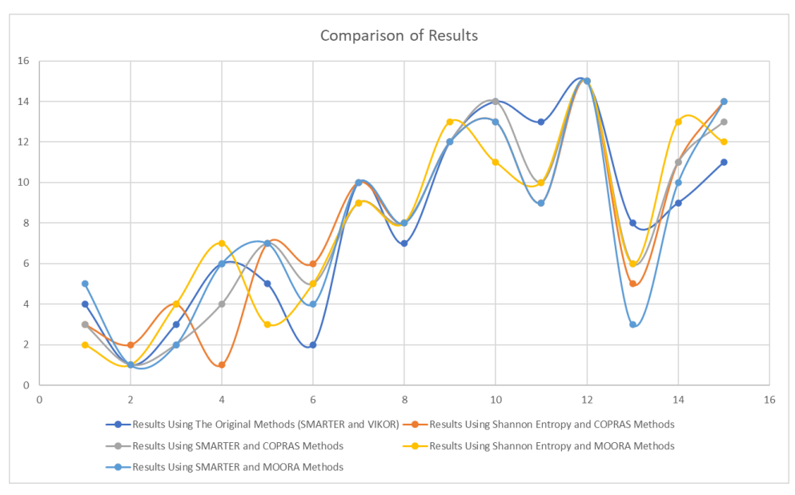

# Evaluating Offers from E-Commerce Vendors Using the VIKOR & SMARTER Methods

This repository contains my coursework for the "Basics of Decision Making"
course at AUT (Tehran Polytechnic).

## Project Description

For this project, we scraped data for a Samsung Galaxy A54 phone from 10 popular
Iranian e-commerce sites. Implemented VIKOR and SMARTER in Excel to rank the
offers based on multiple criteria:

- seller score rating
- number of reviews with 5 stars
- product price
- number of products sold
- distance

## Comparing the Results

